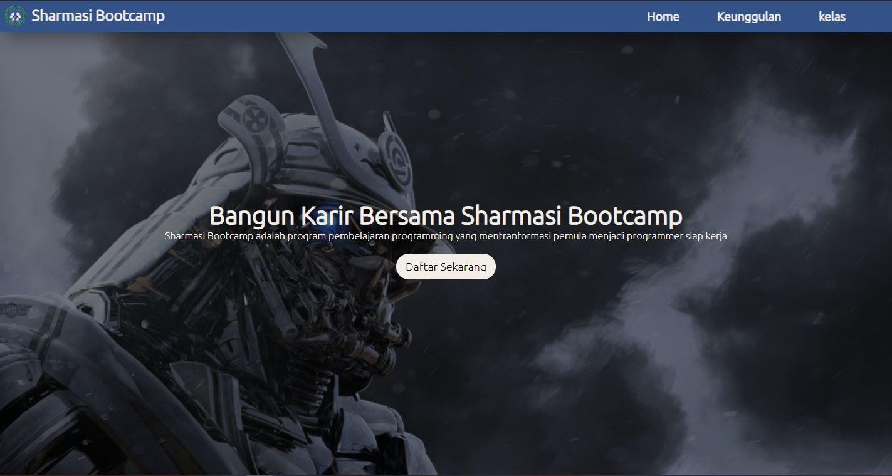

# Tampilan Landing Page 🚀

## css icon Feature

link css icon Feature -> souce(https://cdnjs.com/libraries/font-awesome)

<link rel="stylesheet" href="https://cdnjs.cloudflare.com/ajax/libs/font-awesome/5.15.3/css/all.min.css"/>

## Color UI selection

Pemilihan Color UI -> source(https://colorhunt.co/palette/273174)

dark-blue : #325288;
white : #f4eee8;
cyan : #f5cebe;
dark-green : #114e60;

## Cara Menambahkan efek Hitam pada Image

How to darken image ->source(https://dev.to/nazanin_ashrafi/how-to-darken-an-image-with-css-4f5h#:~:text=For%20making%20it%20darker%2C%20we,gradient(black%2Cblack).&text=To%20sum%20it%20up%20%3A,make%20your%20background%20image%20darker.)

background-image: linear-gradient(rgba(0, 0, 0, 0.527),rgba(0, 0, 0, 0.5)) , url(EauDp1hUcAAE-bK.jpg);

## Box shadow dan Text shadow

box-shadow: 10px 10px 25px rgba(0, 0, 0, 0.35);
text-shadow: 10px 10px 25px rgba(0, 0, 0, 0.35);
